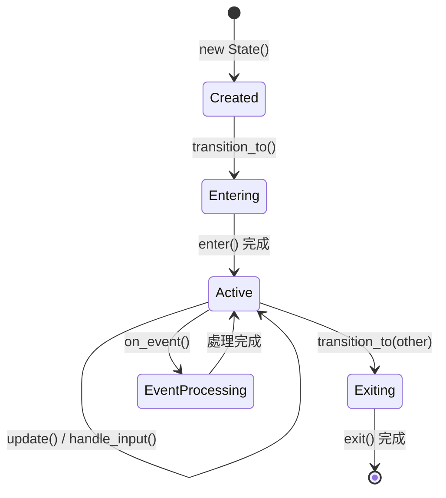

# 九重運命 - 狀態機系統使用說明書

## 📋 目錄
- [概述](#概述)
- [系統架構](#系統架構) 
- [核心組件詳解](#核心組件詳解)
- [完整安裝指南](#完整安裝指南)
- [基礎使用方法](#基礎使用方法)
- [狀態生命週期管理](#狀態生命週期管理)
- [事件系統深度整合](#事件系統深度整合)
- [場景管理完全指南](#場景管理完全指南)
- [戰鬥系統狀態機](#戰鬥系統狀態機)
- [實戰範例集](#實戰範例集)
- [進階功能與技巧](#進階功能與技巧)
- [性能優化指南](#性能優化指南)
- [調試工具詳解](#調試工具詳解)
- [最佳實踐與模式](#最佳實踐與模式)
- [常見問題與解決方案](#常見問題與解決方案)
- [API參考手冊](#api參考手冊)
- [擴展開發指南](#擴展開發指南)

---

## 概述

### 🎯 設計理念

九重運命的狀態機系統是一個企業級、多層次、事件驅動的狀態管理框架，專為複雜的遊戲流程和大型項目設計。系統遵循以下核心設計原則：

- **單一職責原則** - 每個狀態機只負責特定領域的狀態管理
- **開放封閉原則** - 易於擴展新狀態，無需修改現有代碼
- **依賴倒置原則** - 通過 EventBus 實現鬆耦合通信
- **組合優於繼承** - 使用組合模式構建複雜狀態邏輯

### 🏗️ 系統架構概覽

系統包含兩個核心狀態機和一個外部拖放管理器：

#### 1. 遊戲場景狀態機 (GameSceneStateMachine)
- **職責範圍**: 管理主選單、關卡選擇、戰鬥場景、結算畫面等頂級場景切換
- **狀態特點**: 長生命週期、場景級別的狀態管理
- **典型流程**: 主選單 → 關卡選擇 → 戰鬥 → 結算 → 主選單

#### 2. 戰鬥狀態機 (BattleStateMachine)  
- **職責範圍**: 管理戰鬥內部的回合制流程、玩家操作、敵人行動
- **狀態特點**: 動態創建/銷毀、細粒度的戰鬥邏輯
- **典型流程**: 準備 → 玩家回合 → 計算階段 → 敵人回合 → 勝負判定

#### 3. 拖放系統 (DragDropManager)
- **設計決策**: 使用現有的專門化 DragDropManager 而非狀態機
- **職責範圍**: 處理所有拖放相關的 UI 交互和動畫
- **集成方式**: 通過 StateManager 提供統一接口

### 💡 技術優勢

- **🔄 熱插拔支持** - 狀態機可以動態創建和銷毀
- **📊 完整監控** - 提供全面的狀態變化追蹤和調試工具
- **🎭 事件驅動** - 基於 EventBus 的鬆耦合架構
- **⚡ 高性能** - 優化的狀態轉換算法和內存管理
- **🛡️ 類型安全** - 強類型的狀態定義和轉換驗證
- **📚 自文檔化** - 豐富的調試信息和狀態歷史記錄

## 系統架構

### 架構圖
```
StateManager (AutoLoad)
├── GameSceneStateMachine (場景管理)
│   ├── MainMenuState
│   ├── LevelSelectionState
│   ├── BattleState
│   ├── ResultState
│   └── SettingsState
└── BattleStateMachine (戰鬥管理，動態創建)
    ├── PreparingState
    ├── PlayerTurnState
    ├── CalculatingState
    ├── EnemyTurnState
    ├── VictoryState
    └── DefeatState

DragDropManager (AutoLoad) - 獨立處理拖放邏輯
├── 拖拽狀態管理
├── 拖拽預覽系統
├── 投放區域檢測
└── 動畫效果處理
```

### 事件流向
```
EventBus ←→ StateManager ←→ StateMachines ←→ Game Objects
            ↓                     ↑
     DragDropManager ←→ DraggableTiles & DropZones
```

---

## 核心組件詳解

### 1. BaseState (基礎狀態類)
所有具體狀態的基類，提供狀態生命週期管理。

```gdscript
class_name BaseState extends RefCounted

# 主要方法
func enter(previous_state: BaseState = null, data: Dictionary = {})  # 進入狀態
func exit(next_state: BaseState = null)                             # 離開狀態
func update(delta: float)                                           # 每幀更新
func handle_input(event: InputEvent)                               # 處理輸入
func can_transition_to(next_state_id: String) -> bool              # 轉換檢查
func on_event(event_name: String, event_data: Dictionary = {})     # 事件處理
```

### 2. BaseStateMachine (基礎狀態機類)
狀態機核心邏輯，管理狀態轉換和生命週期。

```gdscript
class_name BaseStateMachine extends Node

# 主要方法
func add_state(state: BaseState) -> bool                           # 添加狀態
func transition_to(state_id: String, data: Dictionary = {}) -> bool # 狀態轉換
func get_current_state_id() -> String                              # 獲取當前狀態
func is_in_state(state_id: String) -> bool                        # 檢查狀態
func go_back(data: Dictionary = {}) -> bool                        # 返回上一狀態

# 信號
signal state_changed(previous_state_id: String, current_state_id: String)
signal transition_failed(from_state_id: String, to_state_id: String, reason: String)
```

### 3. StateManager (狀態機管理器 AutoLoad)
統一管理所有狀態機實例，提供全域控制接口。

```gdscript
# 主要屬性
var game_scene_state_machine: GameSceneStateMachine
var battle_state_machine: BattleStateMachine  # 動態創建

# 主要方法
func register_state_machine(name: String, state_machine: BaseStateMachine)
func get_state_machine(name: String) -> BaseStateMachine
func change_scene(scene_type, data: Dictionary = {})
func start_drag(object: Node, position: Vector2) -> bool  # 委託給DragDropManager
```

---

## 完整安裝指南

### 🔧 系統要求

- **Godot 版本**: 4.2+ (建議 4.3+)
- **項目設置**: 2D 或 3D 項目均可
- **腳本語言**: GDScript
- **最小內存**: 建議 512MB+ 可用內存

### 📁 文件結構準備

確保你的項目具有以下目錄結構：

```
項目根目錄/
├── singletons/          # AutoLoad 單例目錄
│   ├── EventBus.gd     # 事件總線（必需）
│   ├── StateManager.gd # 狀態管理器（本系統核心）
│   └── DragDropManager.gd  # 拖放管理器（如果需要拖放功能）
├── scripts/
│   └── state_machine/   # 狀態機腳本目錄
│       ├── BaseState.gd
│       ├── BaseStateMachine.gd
│       ├── GameSceneStateMachine.gd
│       └── BattleStateMachine.gd
├── scenes/             # 遊戲場景目錄（可選）
│   ├── MainMenu.tscn   # 主選單場景
│   ├── Battle.tscn     # 戰鬥場景
│   └── ...
└── test_scenes/        # 測試場景目錄（可選）
    └── StateMachineTest.gd
```

### 🎮 AutoLoad 配置詳解

#### 方法1: 通過 Godot 編輯器設置（推薦）

1. 在 Godot 中打開你的項目
2. 進入 `Project -> Project Settings`
3. 切換到 `AutoLoad` 選項卡
4. **按照以下順序**添加 AutoLoad 項目：

```
順序  名稱           路徑                               單例
1     EventBus       res://singletons/EventBus.gd       ✓
2     StateManager   res://singletons/StateManager.gd   ✓
3     DragDropManager res://singletons/DragDropManager.gd ✓ (如果需要)
```

⚠️ **重要**: AutoLoad 的加載順序很重要！EventBus 必須在 StateManager 之前加載。

#### 方法2: 直接編輯 project.godot 文件

在 `project.godot` 文件的 `[autoload]` 部分添加：

```ini
[autoload]

EventBus="*res://singletons/EventBus.gd"
StateManager="*res://singletons/StateManager.gd"
DragDropManager="*res://singletons/DragDropManager.gd"
```

### ✅ 安裝驗證

創建一個測試腳本來驗證安裝：

```gdscript
# TestStateManager.gd
extends Node

func _ready():
    await get_tree().process_frame  # 等待 AutoLoad 初始化
    
    print("=== 狀態機系統驗證 ===")
    
    # 檢查核心組件
    if StateManager == null:
        print("❌ StateManager 未載入")
        return
        
    if EventBus == null:
        print("❌ EventBus 未載入") 
        return
        
    print("✅ 核心組件載入成功")
    
    # 檢查狀態機
    var scene_sm = StateManager.get_state_machine("game_scene")
    if scene_sm == null:
        print("❌ 場景狀態機未創建")
        return
        
    print("✅ 場景狀態機創建成功")
    print("當前狀態: ", scene_sm.get_current_state_id())
    
    # 測試狀態轉換
    var success = scene_sm.transition_to("level_selection")
    print("狀態轉換結果: ", "成功" if success else "失敗")
    
    print("=== 驗證完成 ===")
```

### 🔍 常見安裝問題

#### 問題1: "StateManager not found" 錯誤
**原因**: AutoLoad 未正確配置或路徑錯誤
**解決**:
```gdscript
# 檢查 project.godot 中是否包含:
[autoload]
StateManager="*res://singletons/StateManager.gd"

# 確認文件路徑正確存在
```

#### 問題2: "Identifier 'GameSceneStateMachine' not declared"
**原因**: 腳本文件缺失或 class_name 未定義
**解決**:
```gdscript
# 確保每個狀態機腳本都有 class_name 聲明
class_name GameSceneStateMachine
extends BaseStateMachine
```

#### 問題3: 狀態機初始化失敗
**原因**: 依賴的 AutoLoad 未正確加載
**解決**:
```gdscript
func _ready():
    # 在使用狀態機前等待一幀
    await get_tree().process_frame
    # 現在可以安全使用 StateManager
    StateManager.go_to_main_menu()
```

### 🚀 快速開始模板

創建一個最小化的示例來測試系統：

```gdscript
# MinimalExample.gd
extends Node

func _ready():
    # 等待系統初始化
    await get_tree().process_frame
    
    # 監聽狀態變化
    EventBus.state_changed.connect(_on_state_changed)
    
    # 測試場景切換
    print("開始測試場景切換...")
    StateManager.go_to_main_menu()
    
    await get_tree().create_timer(1.0).timeout
    
    # 測試戰鬥系統
    EventBus.battle_started.emit({
        "level_id": "test_level",
        "enemies": [{"id": "test_enemy", "hp": 100}]
    })

func _on_state_changed(sm_name: String, prev_state: String, current_state: String):
    print("[%s] %s -> %s" % [sm_name, prev_state, current_state])
```

---

## 基礎使用方法

1. **配置 AutoLoad**
   在 `project.godot` 中添加：
   ```
   [autoload]
   EventBus="*res://singletons/EventBus.gd"
   StateManager="*res://singletons/StateManager.gd"
   ```

2. **確保腳本位置**
   ```
   scripts/state_machine/
   ├── BaseState.gd
   ├── BaseStateMachine.gd
   ├── GameSceneStateMachine.gd
   ├── BattleStateMachine.gd
   └── DragDropStateMachine.gd
   ```

### 基本使用

#### 場景切換
```gdscript
# 方法1：使用StateManager便利方法
StateManager.go_to_main_menu()
StateManager.go_to_battle("level_001")
StateManager.go_to_result("victory", [{"type": "gold", "amount": 100}])

# 方法2：使用場景類型枚舉
StateManager.change_scene(GameSceneStateMachine.SceneType.MAIN_MENU)

# 方法3：通過EventBus
EventBus.scene_transition_requested.emit("level_selection", {"chapter": 1})
```

#### 拖放操作（使用現有DragDropManager）
```gdscript
# 開始拖拽
func _on_tile_input_event(viewport: Node, event: InputEvent, shape_idx: int):
    if event is InputEventMouseButton and event.pressed:
        # 直接使用DragDropManager
        DragDropManager.start_drag(self, event.global_position)
        # 或通過StateManager委託
        StateManager.start_drag(self, event.global_position)

# 監聽拖放事件（使用DragDropManager的信號）
func _ready():
    DragDropManager.tile_drag_started.connect(_on_drag_started)
    DragDropManager.tile_drag_ended.connect(_on_drag_ended)
    DragDropManager.navigation_requested.connect(_on_navigation_requested)

func _on_drag_ended(tile_data: Dictionary, drop_zone, success: bool):
    if success:
        print("成功放置圖塊到 ", drop_zone.name if drop_zone else "未知區域")
    else:
        print("拖放失敗")
```

#### 戰鬥控制
```gdscript
# 開始戰鬥（自動創建戰鬥狀態機）
EventBus.battle_started.emit({
    "level_id": "level_001",
    "enemies": [...],
    "player_hp": 100
})

# 提交玩家回合
StateManager.submit_player_turn()

# 監聽戰鬥狀態
func _ready():
    EventBus.turn_started.connect(_on_turn_started)
    EventBus.damage_calculated.connect(_on_damage_calculated)

func _on_turn_started(turn_number: int):
    print("第 ", turn_number, " 回合開始")
```

---

## 狀態生命週期管理

### 🔄 狀態生命週期概述

每個狀態都有明確定義的生命週期階段，理解這些階段對於正確使用狀態機至關重要：



### 📚 生命週期方法詳解

#### 1. 狀態創建階段

```gdscript
# 狀態實例化 - 只執行一次
class MyState extends BaseState:
    var some_data: Dictionary = {}
    
    func _init():
        super._init("my_state")
        # 初始化不依賴外部數據的內容
        some_data["initialized_at"] = Time.get_unix_time_from_system()
        print("[MyState] 狀態實例已創建")
```

#### 2. 進入狀態 (enter)

```gdscript
func enter(previous_state: BaseState = null, data: Dictionary = {}):
    super.enter(previous_state, data)
    
    # 狀態進入時的初始化工作
    print("[MyState] 進入狀態，來自: ", previous_state.state_id if previous_state else "無")
    
    # 處理傳入的數據
    if data.has("player_level"):
        adjust_difficulty(data.player_level)
    
    # 設置UI元素
    setup_ui()
    
    # 開始背景音樂
    AudioManager.play_bgm("state_music")
    
    # 註冊事件監聽
    EventBus.player_action.connect(_on_player_action)
    
    # 啟動狀態特定的計時器
    start_state_timer()

func setup_ui():
    # UI 設置邏輯
    var ui_scene = preload("res://ui/MyStateUI.tscn").instantiate()
    get_tree().current_scene.add_child(ui_scene)
    
func start_state_timer():
    # 狀態特定的計時器
    var timer = Timer.new()
    timer.wait_time = 5.0
    timer.one_shot = true
    timer.timeout.connect(_on_state_timeout)
    add_child(timer)
    timer.start()
```

#### 3. 活躍狀態 (update/handle_input/on_event)

```gdscript
# 每幀更新 - 謹慎使用，避免性能問題
func update(delta: float):
    super.update(delta)
    
    # 更新狀態特定的數據
    update_animations(delta)
    check_win_conditions()
    
    # 避免在這裡做重計算
    # ❌ 錯誤示例：每幀重新計算路徑
    # ✅ 正確做法：只在需要時計算

func handle_input(event: InputEvent):
    super.handle_input(event)
    
    # 處理狀態特定的輸入
    if event is InputEventKey and event.pressed:
        match event.keycode:
            KEY_ESCAPE:
                # 請求退出狀態
                state_machine.transition_to("pause_menu")
            KEY_SPACE:
                # 狀態特定操作
                perform_action()

func on_event(event_name: String, event_data: Dictionary = {}):
    super.on_event(event_name, event_data)
    
    # 處理EventBus事件
    match event_name:
        "player_died":
            handle_player_death(event_data)
        "item_collected":
            update_inventory(event_data)
        "enemy_spawned":
            register_enemy(event_data)
```

#### 4. 離開狀態 (exit)

```gdscript
func exit(next_state: BaseState = null):
    print("[MyState] 離開狀態，前往: ", next_state.state_id if next_state else "未知")
    
    # 清理工作 - 非常重要！
    cleanup_ui()
    cleanup_timers() 
    cleanup_event_listeners()
    save_state_data()
    
    # 停止背景音樂
    AudioManager.stop_bgm()
    
    # 調用父類清理
    super.exit(next_state)

func cleanup_ui():
    # 移除UI元素
    var ui_nodes = get_tree().get_nodes_in_group("my_state_ui")
    for node in ui_nodes:
        node.queue_free()

func cleanup_event_listeners():
    # 斷開事件連接 - 防止內存泄漏
    if EventBus.player_action.is_connected(_on_player_action):
        EventBus.player_action.disconnect(_on_player_action)

func cleanup_timers():
    # 清理計時器
    for child in get_children():
        if child is Timer:
            child.queue_free()

func save_state_data():
    # 保存狀態數據供後續使用
    GameData.set_state_data(state_id, {
        "last_exit_time": Time.get_unix_time_from_system(),
        "some_important_data": some_data
    })
```

### ⚠️ 生命週期最佳實踐

#### 1. 資源管理原則

```gdscript
# ✅ 正確的資源管理
class GameState extends BaseState:
    var ui_scene: Node = null
    var background_music: AudioStreamPlayer = null
    
    func enter(previous_state: BaseState = null, data: Dictionary = {}):
        super.enter(previous_state, data)
        
        # 創建資源
        ui_scene = preload("res://ui/GameUI.tscn").instantiate()
        get_tree().current_scene.add_child(ui_scene)
        
    func exit(next_state: BaseState = null):
        # 清理資源
        if ui_scene:
            ui_scene.queue_free()
            ui_scene = null
            
        super.exit(next_state)

# ❌ 錯誤的資源管理
class BadState extends BaseState:
    func enter(previous_state: BaseState = null, data: Dictionary = {}):
        # 沒有保存引用，無法正確清理
        preload("res://ui/GameUI.tscn").instantiate()
        get_tree().current_scene.add_child(ui_scene)  # ui_scene 未定義！
```

#### 2. 事件監聽管理

```gdscript
# ✅ 正確的事件監聽管理
class ListeningState extends BaseState:
    func enter(previous_state: BaseState = null, data: Dictionary = {}):
        super.enter(previous_state, data)
        # 連接事件
        EventBus.game_over.connect(_on_game_over)
        
    func exit(next_state: BaseState = null):
        # 斷開事件 - 關鍵！
        if EventBus.game_over.is_connected(_on_game_over):
            EventBus.game_over.disconnect(_on_game_over)
        super.exit(next_state)
        
    func _on_game_over():
        # 處理遊戲結束
        pass

# ❌ 錯誤的事件監聽管理 - 會導致內存泄漏
class BadListeningState extends BaseState:
    func enter(previous_state: BaseState = null, data: Dictionary = {}):
        EventBus.game_over.connect(_on_game_over)
        # 沒有在 exit 中斷開連接！
```

### 🔍 狀態轉換深度分析

#### 轉換時序圖

```
狀態A (當前)          狀態機              狀態B (目標)
    |                   |                    |
    |   transition_to   |                    |
    |------------------>|                    |
    |                   |   檢查轉換條件      |
    |                   |                    |
    |      exit()       |                    |
    |<------------------|                    |
    |   執行清理工作     |                    |
    |                   |                    |
    |                   |      enter()      |
    |                   |------------------>|
    |                   |                   | 執行初始化工作
    |                   |                   |
    |                   | state_changed 事件|
    |                   |------------------>| (EventBus)
```

#### 條件轉換示例

```gdscript
class ConditionalState extends BaseState:
    func can_transition_to(next_state_id: String) -> bool:
        match next_state_id:
            "battle":
                # 檢查多個條件
                return has_enough_energy() and \
                       has_valid_team() and \
                       level_is_unlocked()
            
            "shop":
                return has_currency()
                
            "settings":
                return true  # 設置總是可以進入
                
            _:
                return super.can_transition_to(next_state_id)
    
    func has_enough_energy() -> bool:
        return GameData.player_energy >= 10
    
    func has_valid_team() -> bool:
        return GameData.current_team.size() > 0
    
    func level_is_unlocked() -> bool:
        return GameData.unlocked_levels.has(GameData.target_level)
```

---

## 事件系統深度整合

### 🎭 EventBus 架構詳解

EventBus 是狀態機系統的神經中樞，負責協調所有組件間的通信：

```gdscript
# EventBus 事件分類和命名規範
extends Node

# 1. 系統級事件（全局影響）
signal game_started()
signal game_paused(pause_data: Dictionary)
signal game_resumed()
signal application_focus_changed(focused: bool)

# 2. 狀態機事件（狀態管理）
signal state_changed(sm_name: String, previous: String, current: String)
signal transition_failed(sm_name: String, from: String, to: String, reason: String)
signal state_machine_created(sm_name: String, sm_instance: BaseStateMachine)

# 3. 場景級事件（場景生命週期）
signal scene_transition_requested(target: String, data: Dictionary)
signal scene_entered(scene_name: String, load_time: float)
signal scene_exited(scene_name: String)
signal scene_load_progress(scene_name: String, progress: float)

# 4. 戰鬥系統事件（戰鬥邏輯）
signal battle_started(level_data: Dictionary)
signal battle_ended(result: String, rewards: Array, statistics: Dictionary)
signal turn_started(turn_number: int, player_type: String)
signal turn_ended(turn_summary: Dictionary)
signal damage_calculated(damage_info: Dictionary)
signal skill_activated(skill_id: String, caster: Node, targets: Array)

# 5. 玩家交互事件（用戶操作）
signal player_input_received(input_type: String, input_data: Dictionary)
signal ui_element_clicked(element_id: String, context: Dictionary)
signal drag_operation_completed(operation_result: Dictionary)

# 6. 遊戲邏輯事件（業務邏輯）
signal resource_changed(resource_type: String, old_value: int, new_value: int)
signal achievement_unlocked(achievement_id: String)
signal level_completed(level_id: String, score: int, time: float)
```

### 🔗 事件訂閱與發布模式

#### 1. 狀態機自動事件訂閱

```gdscript
class AutoEventState extends BaseState:
    # 自動事件訂閱表
    var event_subscriptions: Dictionary = {
        "player_died": "_on_player_died",
        "item_collected": "_on_item_collected", 
        "enemy_defeated": "_on_enemy_defeated"
    }
    
    func enter(previous_state: BaseState = null, data: Dictionary = {}):
        super.enter(previous_state, data)
        
        # 自動訂閱事件
        for event_name in event_subscriptions:
            var method_name = event_subscriptions[event_name]
            if EventBus.has_signal(event_name) and has_method(method_name):
                EventBus.connect(event_name, Callable(self, method_name))
                print("[%s] 訂閱事件: %s -> %s" % [state_id, event_name, method_name])
    
    func exit(next_state: BaseState = null):
        # 自動取消訂閱
        for event_name in event_subscriptions:
            var method_name = event_subscriptions[event_name]
            if EventBus.has_signal(event_name) and EventBus.is_connected(event_name, Callable(self, method_name)):
                EventBus.disconnect(event_name, Callable(self, method_name))
        
        super.exit(next_state)
    
    # 事件處理方法
    func _on_player_died(death_data: Dictionary):
        print("[%s] 玩家死亡: %s" % [state_id, death_data])
        state_machine.transition_to("game_over", death_data)
    
    func _on_item_collected(item_data: Dictionary):
        print("[%s] 收集物品: %s" % [state_id, item_data.item_name])
        # 更新UI或觸發動畫
    
    func _on_enemy_defeated(enemy_data: Dictionary):
        print("[%s] 敵人被擊敗: %s" % [state_id, enemy_data.enemy_id])
        # 檢查勝利條件
```

#### 2. 條件事件處理

```gdscript
class ConditionalEventState extends BaseState:
    var active_conditions: Dictionary = {}
    
    func enter(previous_state: BaseState = null, data: Dictionary = {}):
        super.enter(previous_state, data)
        
        # 設置條件監聽
        setup_conditional_events()
    
    func setup_conditional_events():
        # 複雜條件：當玩家血量低於20%且敵人數量>3時
        add_condition("low_health_many_enemies", {
            "events": ["player_health_changed", "enemy_count_changed"],
            "condition": func(): return GameData.player_health < GameData.max_health * 0.2 and GameData.enemy_count > 3,
            "action": func(): state_machine.transition_to("desperate_mode")
        })
        
        # 時間條件：戰鬥超過5分鐘
        add_condition("battle_timeout", {
            "events": ["turn_started"],
            "condition": func(): return Time.get_time_dict_from_system().get("unix") - battle_start_time > 300,
            "action": func(): EventBus.emit_signal("battle_timeout_warning")
        })
    
    func add_condition(condition_name: String, condition_data: Dictionary):
        active_conditions[condition_name] = condition_data
        
        # 為相關事件添加監聽
        for event_name in condition_data.events:
            if not EventBus.is_connected(event_name, _on_conditional_event):
                EventBus.connect(event_name, _on_conditional_event)
    
    func _on_conditional_event(event_data: Dictionary = {}):
        # 檢查所有活躍條件
        for condition_name in active_conditions:
            var condition = active_conditions[condition_name]
            if condition.condition.call():
                print("[%s] 條件觸發: %s" % [state_id, condition_name])
                condition.action.call()
                # 可選：觸發後移除條件
                # active_conditions.erase(condition_name)
```

#### 3. 事件鏈與級聯處理

```gdscript
class EventChainState extends BaseState:
    var event_chain: Array = []
    var current_chain_step: int = 0
    
    func enter(previous_state: BaseState = null, data: Dictionary = {}):
        super.enter(previous_state, data)
        
        # 設置事件鏈
        setup_event_chain()
        start_event_chain()
    
    func setup_event_chain():
        # 定義複雜的事件序列
        event_chain = [
            {
                "name": "intro_animation",
                "duration": 2.0,
                "action": func(): play_intro_animation(),
                "next_event": "show_dialogue"
            },
            {
                "name": "show_dialogue", 
                "trigger": "dialogue_finished",
                "action": func(): show_character_dialogue(),
                "next_event": "enable_player_input"
            },
            {
                "name": "enable_player_input",
                "action": func(): enable_player_controls(),
                "next_event": null  # 鏈結束
            }
        ]
    
    func start_event_chain():
        if event_chain.size() > 0:
            execute_chain_step(0)
    
    func execute_chain_step(step_index: int):
        if step_index >= event_chain.size():
            print("[%s] 事件鏈完成" % state_id)
            return
            
        current_chain_step = step_index
        var step = event_chain[step_index]
        
        print("[%s] 執行事件鏈步驟: %s" % [state_id, step.name])
        step.action.call()
        
        # 設置下一步觸發條件
        if step.has("duration"):
            # 時間觸發
            get_tree().create_timer(step.duration).timeout.connect(_on_chain_timer)
        elif step.has("trigger"):
            # 事件觸發
            EventBus.connect(step.trigger, _on_chain_event_triggered)
        else:
            # 立即執行下一步
            call_deferred("execute_next_step")
    
    func execute_next_step():
        var current_step = event_chain[current_chain_step]
        if current_step.next_event:
            var next_index = event_chain.find(func(step): return step.name == current_step.next_event)
            if next_index != -1:
                execute_chain_step(next_index)
        else:
            print("[%s] 事件鏈結束" % state_id)
    
    func _on_chain_timer():
        execute_next_step()
    
    func _on_chain_event_triggered():
        execute_next_step()
```

### 📡 事件優先級與過濾

```gdscript
class PriorityEventState extends BaseState:
    enum EventPriority {
        LOW = 0,
        NORMAL = 1, 
        HIGH = 2,
        CRITICAL = 3
    }
    
    var event_filters: Dictionary = {}
    var event_queue: Array = []
    
    func enter(previous_state: BaseState = null, data: Dictionary = {}):
        super.enter(previous_state, data)
        
        # 設置事件過濾器
        setup_event_filters()
        
        # 連接到所有相關事件
        EventBus.connect("player_action", _on_event_received.bind("player_action", EventPriority.NORMAL))
        EventBus.connect("enemy_attack", _on_event_received.bind("enemy_attack", EventPriority.HIGH))
        EventBus.connect("system_error", _on_event_received.bind("system_error", EventPriority.CRITICAL))
    
    func setup_event_filters():
        # 只在特定條件下處理某些事件
        event_filters = {
            "player_action": func(data): return is_player_turn(),
            "enemy_attack": func(data): return not is_player_invulnerable(),
            "item_use": func(data): return has_item(data.item_id)
        }
    
    func _on_event_received(event_name: String, priority: EventPriority, event_data: Dictionary = {}):
        # 應用過濾器
        if event_filters.has(event_name):
            if not event_filters[event_name].call(event_data):
                print("[%s] 事件被過濾: %s" % [state_id, event_name])
                return
        
        # 添加到優先級隊列
        var event_item = {
            "name": event_name,
            "priority": priority,
            "data": event_data,
            "timestamp": Time.get_time_dict_from_system()
        }
        
        add_to_priority_queue(event_item)
        process_event_queue()
    
    func add_to_priority_queue(event_item: Dictionary):
        # 按優先級插入隊列
        var inserted = false
        for i in range(event_queue.size()):
            if event_queue[i].priority < event_item.priority:
                event_queue.insert(i, event_item)
                inserted = true
                break
        
        if not inserted:
            event_queue.append(event_item)
    
    func process_event_queue():
        while event_queue.size() > 0:
            var event_item = event_queue.pop_front()
            handle_prioritized_event(event_item)
    
    func handle_prioritized_event(event_item: Dictionary):
        print("[%s] 處理優先級事件: %s (優先級: %d)" % [state_id, event_item.name, event_item.priority])
        
        match event_item.name:
            "system_error":
                handle_critical_error(event_item.data)
            "enemy_attack":
                handle_enemy_attack(event_item.data)
            "player_action":
                handle_player_action(event_item.data)
```

### 🎯 自定義事件系統擴展

```gdscript
# 為你的項目創建專門的事件管理器
class GameEventManager extends Node:
    
    # 事件統計
    var event_statistics: Dictionary = {}
    
    # 事件回放系統
    var event_history: Array = []
    var max_history_size: int = 1000
    
    # 事件驗證
    var event_validators: Dictionary = {}
    
    func _ready():
        # 連接到 EventBus 進行事件攔截和處理
        EventBus.connect("*", _on_any_event)  # 需要修改 EventBus 支持通配符
    
    func emit_validated_event(event_name: String, event_data: Dictionary = {}):
        # 驗證事件數據
        if not validate_event(event_name, event_data):
            push_error("事件驗證失敗: " + event_name)
            return false
        
        # 記錄統計
        record_event_statistics(event_name)
        
        # 添加到歷史
        add_to_history(event_name, event_data)
        
        # 發送事件
        EventBus.emit_signal(event_name, event_data)
        return true
    
    func validate_event(event_name: String, event_data: Dictionary) -> bool:
        if not event_validators.has(event_name):
            return true  # 沒有驗證器就通過
        
        return event_validators[event_name].call(event_data)
    
    func add_event_validator(event_name: String, validator: Callable):
        event_validators[event_name] = validator
    
    func record_event_statistics(event_name: String):
        if not event_statistics.has(event_name):
            event_statistics[event_name] = {"count": 0, "last_time": 0}
        
        event_statistics[event_name].count += 1
        event_statistics[event_name].last_time = Time.get_unix_time_from_system()
    
    func get_event_statistics() -> Dictionary:
        return event_statistics.duplicate()
    
    func replay_events_from_time(start_time: float):
        # 事件回放功能 - 用於調試和測試
        for event in event_history:
            if event.timestamp >= start_time:
                EventBus.emit_signal(event.name, event.data)
                await get_tree().process_frame  # 逐幀回放
```

---

## 實戰範例

### 範例1：自定義場景狀態

```gdscript
# 創建商店場景狀態
class ShopState extends BaseState:
    func _init():
        super._init("shop")
    
    func enter(previous_state: BaseState = null, data: Dictionary = {}):
        super.enter(previous_state, data)
        
        # 載入商店場景
        var shop_scene = load("res://scenes/Shop.tscn").instantiate()
        get_tree().root.add_child(shop_scene)
        
        # 初始化商店數據
        if shop_scene.has_method("initialize_shop"):
            shop_scene.initialize_shop(data)
        
        EventBus.emit_signal("scene_entered", "shop")
    
    func can_transition_to(next_state_id: String) -> bool:
        # 商店可以返回主選單或進入其他場景
        return next_state_id in ["main_menu", "battle", "level_selection"]

# 添加到場景狀態機
func _ready():
    var scene_sm = StateManager.get_state_machine("game_scene")
    scene_sm.add_state(ShopState.new())
```

### 範例2：自定義戰鬥狀態

```gdscript
# 創建技能選擇狀態
class SkillSelectionState extends BaseState:
    var available_skills: Array = []
    var selected_skill: String = ""
    
    func _init():
        super._init("skill_selection")
    
    func enter(previous_state: BaseState = null, data: Dictionary = {}):
        super.enter(previous_state, data)
        
        available_skills = data.get("skills", [])
        
        # 顯示技能選擇UI
        EventBus.emit_signal("ui_popup_requested", "skill_selection", {
            "skills": available_skills
        })
    
    func on_event(event_name: String, event_data: Dictionary = {}):
        super.on_event(event_name, event_data)
        
        match event_name:
            "skill_selected":
                selected_skill = event_data.get("skill_id", "")
                _confirm_skill_selection()
    
    func _confirm_skill_selection():
        # 執行技能並返回戰鬥狀態
        EventBus.emit_signal("skill_activated", selected_skill)
        state_machine.transition_to("calculating", {"skill_used": selected_skill})
```

### 範例3：高級拖放邏輯

```gdscript
# 擴展拖放狀態機支持多選
class MultiSelectDragState extends BaseState:
    var selected_objects: Array = []
    
    func _init():
        super._init("multi_dragging")
    
    func enter(previous_state: BaseState = null, data: Dictionary = {}):
        super.enter(previous_state, data)
        
        selected_objects = data.get("objects", [])
        
        # 創建多物件預覽
        _create_multi_preview()
    
    func handle_input(event: InputEvent):
        super.handle_input(event)
        
        if event is InputEventMouseMotion:
            _update_multi_preview_positions(event.global_position)
    
    func _create_multi_preview():
        # 為每個選中物件創建預覽
        for obj in selected_objects:
            # 實現多物件預覽邏輯
            pass
```

---

## 進階功能

### 狀態歷史追蹤

```gdscript
# 獲取狀態歷史
var scene_sm = StateManager.get_state_machine("game_scene")
var debug_info = scene_sm.get_debug_info()
print("狀態歷史: ", debug_info.state_history)

# 返回上一狀態
scene_sm.go_back()
```

### 條件狀態轉換

```gdscript
class ConditionalState extends BaseState:
    func can_transition_to(next_state_id: String) -> bool:
        match next_state_id:
            "battle":
                # 檢查是否有足夠體力
                return GameData.player_energy > 0
            "shop":
                # 檢查是否解鎖商店
                return GameData.shop_unlocked
            _:
                return true
```

### 狀態數據持久化

```gdscript
# 保存狀態數據
func save_state_data():
    var state_data = {
        "current_scene": StateManager.get_current_scene_state(),
        "scene_history": StateManager.game_scene_state_machine.state_history,
        "battle_state": StateManager.get_current_battle_state()
    }
    
    # 保存到文件或玩家數據
    GameData.save_state_machine_data(state_data)

# 恢復狀態數據
func restore_state_data():
    var state_data = GameData.load_state_machine_data()
    
    if state_data.has("current_scene"):
        StateManager.game_scene_state_machine.transition_to(state_data.current_scene)
```

---

## 調試工具

### 狀態機調試面板

```gdscript
# 顯示調試信息
StateManager.print_debug_info()

# 獲取詳細調試數據
var debug_data = StateManager.get_debug_info()
for sm_name in debug_data.state_machines:
    var sm_info = debug_data.state_machines[sm_name]
    print(sm_name, ": ", sm_info.current_state)
```

### 實時狀態監控

```gdscript
# 監聽所有狀態變化
func _ready():
    EventBus.state_changed.connect(_on_any_state_changed)

func _on_any_state_changed(sm_name: String, prev_state: String, current_state: String):
    print("[", sm_name, "] ", prev_state, " -> ", current_state)
```

### 錯誤診斷

```gdscript
# 監聽轉換失敗
func _ready():
    EventBus.transition_failed.connect(_on_transition_failed)

func _on_transition_failed(sm_name: String, from_state: String, to_state: String, reason: String):
    push_error("狀態轉換失敗: [" + sm_name + "] " + from_state + " -> " + to_state + " (" + reason + ")")
```

---

## 最佳實踐

### 1. 狀態設計原則
- **單一職責**: 每個狀態只負責一個明確的遊戲狀態
- **最小化數據**: 狀態間只傳遞必要的數據
- **避免循環依賴**: 狀態不應直接引用其他狀態

### 2. 事件驅動設計
```gdscript
# ✅ 好的做法：使用事件通信
func on_enemy_defeated():
    EventBus.emit_signal("enemy_defeated", enemy_id, rewards)

# ❌ 避免：直接調用狀態機方法
func on_enemy_defeated():
    battle_state_machine.transition_to("victory")  # 緊耦合
```

### 3. 錯誤處理
```gdscript
# 總是檢查狀態轉換結果
var success = state_machine.transition_to("next_state")
if not success:
    print("狀態轉換失敗，執行備用邏輯")
    # 執行備用邏輯
```

### 4. 性能優化
```gdscript
# 避免在update中執行複雜邏輯
func update(delta: float):
    # ✅ 輕量級操作
    time_remaining -= delta
    
    # ❌ 避免重複的複雜計算
    # calculate_complex_ai_behavior()  
```

---

## 常見問題

### Q: 如何添加新的遊戲場景？
A: 
1. 在 `GameSceneStateMachine.SceneType` 枚舉中添加新類型
2. 更新 `scene_paths` 和 `scene_state_mapping` 字典
3. 創建對應的狀態類
4. 在 `_initialize_scene_states()` 中添加狀態

### Q: 戰鬥狀態機何時創建和銷毀？
A: 戰鬥狀態機在收到 `battle_started` 事件時自動創建，在 `battle_ended` 事件時自動銷毀。這確保了記憶體的有效利用。

### Q: 如何擴展拖放功能支持新的操作？
A: 
1. 在 `DragDropStateMachine` 中添加新的狀態類
2. 擴展 `DragDropStateType` 枚舉
3. 實現具體的拖放邏輯
4. 通過EventBus發送相關事件

### Q: 狀態機之間如何通信？
A: 狀態機之間不應直接通信，而是通過EventBus發送事件。StateManager會協調不同狀態機的行為。

### Q: 如何調試狀態轉換問題？
A: 
1. 啟用調試模式：`StateManager.set_debug_enabled(true)`
2. 監聽 `transition_failed` 事件
3. 使用 `print_debug_info()` 查看狀態機狀態
4. 檢查 `can_transition_to()` 方法的邏輯

---

## 總結

九重運命的狀態機系統提供了：
- 🎯 **清晰的架構** - 分層設計，職責明確
- 🔄 **靈活的擴展** - 易於添加新狀態和功能  
- 🎭 **事件驅動** - 鬆耦合的組件通信
- 🛠️ **豐富的工具** - 完整的調試和監控功能
- 📚 **完善的文檔** - 詳細的使用指南和範例

通過合理使用這個狀態機系統，你可以輕鬆管理複雜的遊戲流程，讓代碼更加清晰、可維護和可擴展。